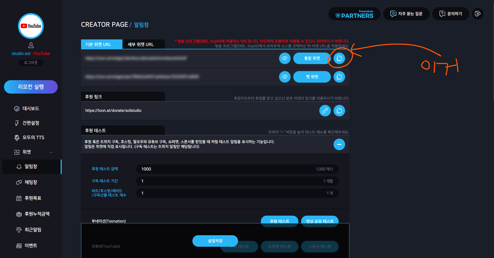

# 용도
투네이션으로 오는 도네이션을 실시간으로 포착하여 다양한 용도로 활용 가능합니다.

# 세팅 방법
[여기](https://toon.at/streamer/widget_alertbox)에 접속한 후, 맨 위의 "기본 위젯 URL" -> "통합 위젯" 옆의 버튼을 클릭하여 URL을 복사합니다.

main.py의 상단에 있는 `(여기에 붙여넣으세요)`를 지우고 복사한 URL을 붙여넣습니다 
